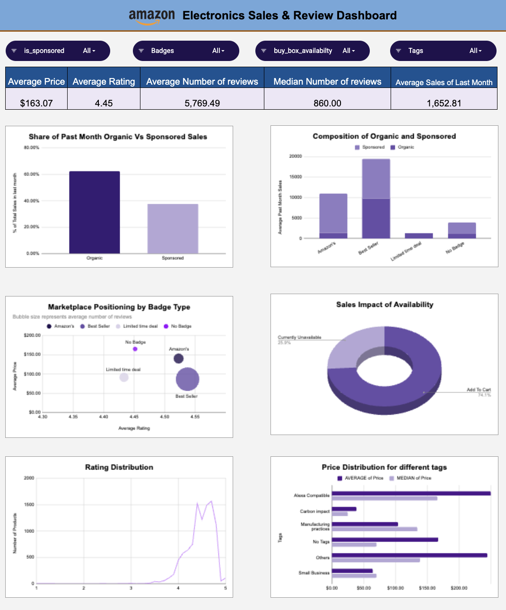

# Amazon Electronics Sales & Review Dashboard

  

---

## Dashboard Preview

  

---

## Project Overview

This project analyzes Amazon Electronics product data to identify key drivers of product demand, customer engagement, pricing strategy, and platform visibility.

The dashboard supports data-driven decision-making by evaluating how ratings, reviews, pricing, sponsorship, badges, coupons, availability, and tags impact product performance.

---

## Objectives

- Evaluate the impact of Sponsored listings on demand
- Analyze the effect of Buy Box availability on sales
- Study how ratings and reviews influence purchase behavior
- Examine pricing distribution and premium positioning
- Identify badge and tag performance impact

---

## Dataset Information

- Source: Kaggle – Amazon Electronics Dataset  
- Domain: E-commerce (Electronics)  
- Structure: Each row represents one product listing  
- Tool Used: Google Sheets  

---

## Data Dictionary

| Column Name | Description | Data Type |
|-------------|------------|-----------|
| `title` | Full product title as listed on Amazon | String (Text) |
| `rating` | Average customer rating (1–5 scale) | Float (Decimal) |
| `number_of_reviews` | Total number of customer reviews | Integer |
| `bought_in_last_month` | Estimated number of units purchased in the last month (proxy for demand) | Integer |
| `Badges` | Product badge or recognition (e.g., Amazon's, No Badge) | Categorical (String) |
| `is_sponsored` | Indicates whether product is a Sponsored listing (Sponsored / Organic) | Categorical (Binary String) |
| `is_couponed` | Indicates whether a coupon is available (TRUE / FALSE) | Boolean |
| `buy_box_availabilty` | Product availability status (Add To Cart / Currently Unavailable) | Categorical (String) |
| `Tags` | Additional product classification or sustainability tag | Categorical (String) |
| `Price` | Listed product price (USD) | Float (Currency) |

---

## Data Cleaning & Preparation

- Converted price from text (e.g., "$1,538.97") to numeric format
- Removed comma formatting in review counts
- Standardized availability labels
- Standardized badge categories
- Verified rating values remain within 1–5 range
- Treated missing purchase values as zero demand
- Ensured numeric consistency for analysis and pivot tables

---

## Key KPIs

| KPI | Value |
|------|-------|
| Average Price | $163.07 |
| Average Rating | 4.45 |
| Average Reviews | 5,769 |
| Median Reviews | 860 |
| Average Monthly Demand | 1,652 |
| Availability | 74.1% Available |

The gap between average and median values indicates skewed engagement and pricing distribution.

---

## Dashboard Components

1. Organic vs Sponsored Sales Comparison  
   Evaluates the effect of paid visibility on demand.

2. Composition by Badge Type  
   Compares sales performance across badge segments.

3. Marketplace Positioning  
   Displays relationship between rating, price, and customer engagement.

4. Product Availability Distribution  
   Shows proportion of available vs unavailable listings.

5. Rating Distribution  
   Illustrates concentration of products within high-rating range.

6. Price Distribution by Tags  
   Identifies premium vs budget positioning across product tags.

---

## Key Insights

- Sponsored listings demonstrate higher average demand.
- Organic products tend to accumulate higher review counts over time.
- Best Seller and Amazon’s badge products show stronger performance.
- Approximately one-fourth of products are unavailable, representing potential revenue loss.
- Engagement is highly skewed — a small number of products dominate reviews.
- High ratings (>4.0) are strongly associated with higher purchase activity.
- Premium-priced products significantly increase average price relative to median.

---

## Business Recommendations

1. Increase sponsored promotion for high-rating products.
2. Improve Buy Box eligibility to reduce lost conversions.
3. Implement structured review-generation strategies.
4. Identify high-quality but low-visibility products for promotion.
5. Apply segmented pricing strategy (Budget / Mid-range / Premium).
6. Maintain inventory discipline for high-demand products.

---

## Limitations

- Snapshot dataset (no historical time-series trends)
- Demand measured using proxy (`bought_in_last_month`)
- No revenue or profit margin data available
- No demographic or customer segmentation
- Cannot infer causality, only associations

---

## Conclusion

Customer trust (ratings and reviews), platform visibility (Sponsored and Badges), pricing structure, and Buy Box availability are the primary drivers of demand in the Amazon electronics category.

This dashboard enables structured analysis and supports strategic decisions in pricing, promotion, and inventory management.
