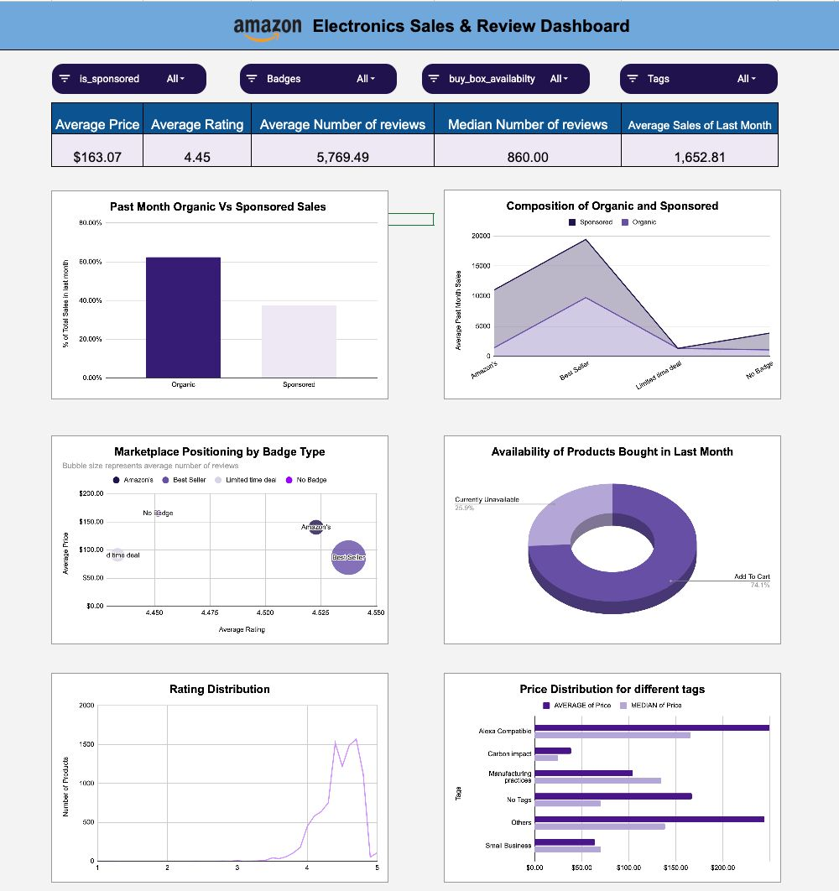

# 📊 Amazon Electronics Sales & Review Dashboard

  

---

## 📌 Dashboard Preview

  

---

## 📖 Project Overview

This project analyzes Amazon Electronics product data to identify key drivers of product demand, customer engagement, pricing strategy, and platform visibility.

The goal is to support data-driven decision-making for sellers and marketplace managers by evaluating how ratings, reviews, pricing, sponsorship, badges, and availability impact product performance.

---

## 🎯 Objectives

- Evaluate the impact of Sponsored listings on demand
- Analyze the effect of Buy Box availability on sales
- Study how ratings and reviews influence purchase behavior
- Examine pricing distribution and premium positioning
- Identify badge and tag performance impact

---

## 📂 Dataset Information

- **Source:** Kaggle – Amazon Electronics Dataset  
- **Size:** ~9,999 products  
- **Domain:** E-commerce (Electronics)  
- **Tool Used:** Google Sheets  

Each row represents a product listing.

### 🔑 Key Columns

- `rating` – Average product rating (1–5)
- `number_of_reviews` – Total review count
- `price` – Estimated product price
- `bought_in_last_month` – Proxy for demand
- `is_sponsored` – Sponsored listing indicator
- `is_best_seller` – Best Seller badge flag
- `buy_box_availability` – Add to Cart / Unavailable
- `badges` – Product certifications/features

---

## 🧹 Data Cleaning & Preparation

- Converted text-based numeric columns to numeric format
- Standardized badge and availability categories
- Handled missing review and purchase values
- Verified rating range (1–5)
- Reviewed price outliers for validity
- Removed irrelevant columns
- Created structured variables for pivot analysis

---

## 📊 Key KPIs

| KPI | Value |
|------|-------|
| Average Price | $163.07 |
| Average Rating | 4.45 |
| Average Reviews | 5,769 |
| Median Reviews | 860 |
| Average Monthly Demand | 1,652 |
| Availability | 74.1% Available |

The difference between average and median values indicates skewed engagement and pricing distribution.

---

## 📈 Dashboard Components

1. **Organic vs Sponsored Sales (Bar Chart)**  
   Evaluates impact of paid visibility on demand.

2. **Composition by Badge Type (Category Comparison)**  
   Compares sales performance across badge segments.

3. **Marketplace Positioning (Bubble Chart)**  
   Displays relationship between rating, price, and review engagement.

4. **Product Availability (Donut Chart)**  
   Shows Add-to-Cart vs Unavailable products.

5. **Rating Distribution (Line Chart)**  
   Illustrates concentration of high-rated products.

6. **Price Distribution by Tags (Bar Chart)**  
   Identifies premium vs budget positioning across product tags.

---

## 🔍 Key Insights

- Sponsored listings generate significantly higher demand.
- Organic products show stronger long-term trust (higher review counts).
- Best Seller products dominate monthly purchases.
- Approximately 26% of products are unavailable, indicating revenue loss risk.
- Customer engagement is highly skewed — a small percentage of products dominate reviews.
- High ratings (>4.0) strongly correlate with higher demand.
- Premium-priced products inflate average price compared to median.

---

## 💡 Business Recommendations

1. **Increase Sponsored Promotion for High-Rating Products**
   - Boost visibility for products with rating > 4.0
   - Accelerate demand growth

2. **Improve Buy Box Eligibility**
   - Optimize pricing and inventory
   - Reduce lost sales due to unavailability

3. **Focus on Review Generation Strategy**
   - Encourage verified customer feedback
   - Improve conversion through trust-building

4. **Promote High-Quality, Low-Visibility Products**
   - Identify strong products with low demand
   - Apply targeted advertising

5. **Implement Price Segmentation Strategy**
   - Segment into Budget / Mid-range / Premium
   - Apply category-specific promotion tactics

---

## ⚠️ Limitations

- Snapshot dataset (no time-series trends)
- Demand measured using proxy (`bought_in_last_month`)
- No revenue or profit data available
- No demographic segmentation
- No historical performance tracking

---

## 📌 Conclusion

Customer trust (ratings & reviews), platform visibility (Sponsored & Badges), and Buy Box availability are the strongest drivers of demand in the Amazon electronics category.

This dashboard enables structured, data-driven decision-making for pricing, promotion, and inventory strategy optimization.
